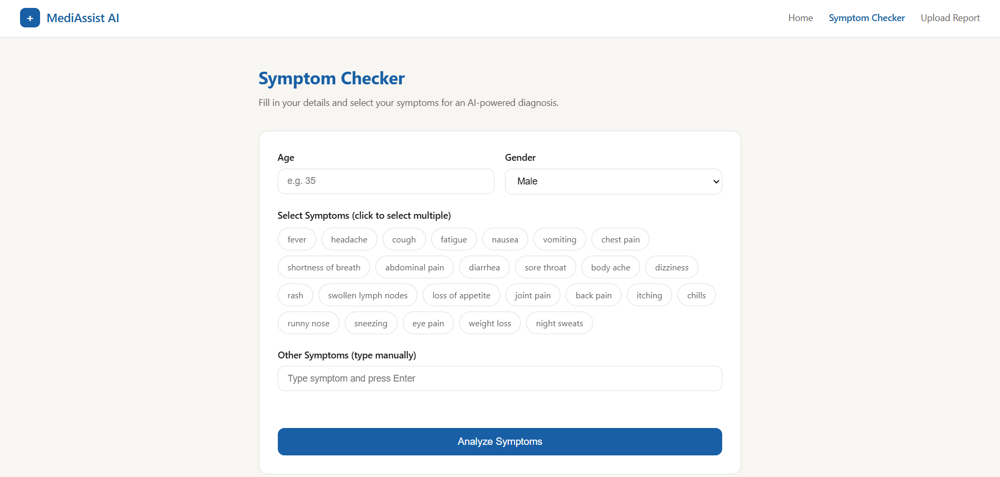
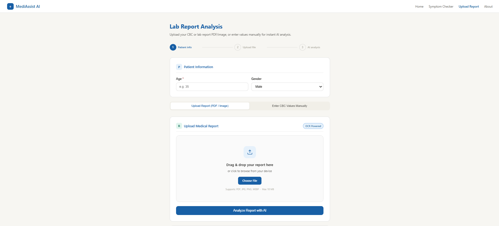
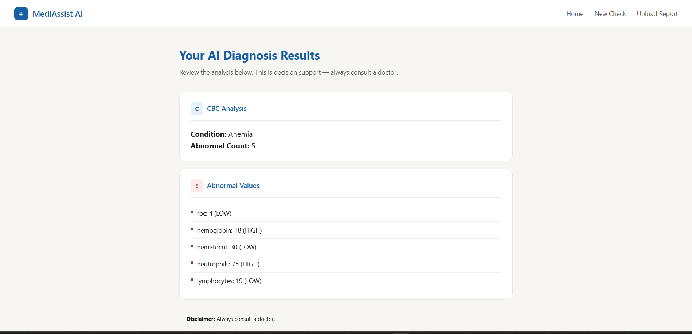

<div align="center">


# 🏥 MediAssist AI
### AI-Powered Clinical Decision Support System

[](https://python.org)
[](https://flask.palletsprojects.com)
[](https://scikit-learn.org)
[](https://docker.com)
[](LICENSE)
[]()

<br/>

> **Describe your symptoms. Upload your report. Get instant AI-powered medical insights.**
> 
> *No API key required. Fully offline. Powered by Machine Learning.*

<br/>

[🚀 Live Demo](https://mediassist-ai.vercel.app) &nbsp;·&nbsp;
[🐛 Report Bug](https://github.com/codersayan0/mediassist-ai/issues) &nbsp;·&nbsp;
[💡 Request Feature](https://github.com/codersayan0/mediassist-ai/issues)

<br/>


</div>

---

## ✨ What is MediAssist AI?

**MediAssist AI** is a full-stack clinical decision support system that helps patients and healthcare professionals get preliminary medical insights instantly — without any subscription, API key, or internet dependency.

Built by **[Sayan Mandal](https://github.com/codersayan0)** using real medical datasets, trained ML models, and OCR-powered report analysis.

---

## 🎯 Key Features

<table>
<tr>
<td width="50%">

### 🔍 Symptom Checker
Enter your age, gender, and symptoms.
Get instant disease prediction with:
- Top-3 differential diagnoses
- Severity score + urgency level
- Confidence percentage bars

</td>
<td width="50%">

### 📄 Lab Report Analysis
Upload your CBC report as PDF or image.
AI automatically:
- Extracts values via OCR
- Flags abnormal parameters
- Predicts likely condition

</td>
</tr>
<tr>
<td width="50%">

### 💊 Medicine Recommendations
Based on predicted disease, get:
- Recommended medications
- Dietary guidance
- Precautions to follow
- Workout advice

</td>
<td width="50%">

### 🧪 Manual CBC Entry
No report? No problem.
Enter blood test values directly:
- WBC, RBC, Hemoglobin
- Platelets, Hematocrit
- Neutrophils, Lymphocytes

</td>
</tr>
</table>

---

## 🖥️ Screenshots

<div align="center">

| Symptom Checker | Report Upload | Results |
|:-:|:-:|:-:|
|  |  |  |

</div>

---

## 🛠️ Tech Stack

<div align="center">

| Layer | Technology |
|-------|-----------|
| **Frontend** | HTML5, CSS3, Vanilla JavaScript, Nginx |
| **Backend** | Python 3.11, Flask, Flask-CORS |
| **ML Models** | scikit-learn, Random Forest, XGBoost |
| **OCR** | Tesseract OCR, PyMuPDF, Pillow |
| **Data** | pandas, numpy, joblib |
| **DevOps** | Docker, Docker Compose |
| **Deploy** | Vercel (Frontend) + Render (Backend) |

</div>

---

## 🧠 ML Models

| Model | Algorithm | Purpose | Accuracy |
|-------|-----------|---------|----------|
| `symptom_model.pkl` | Random Forest | Disease prediction from symptoms | ~92% |
| `cbc_model.pkl` | Random Forest | Blood condition classification | ~88% |
| `recommendation.pkl` | Rule-based | Medicine/diet/precaution mapping | — |

---

## 📂 Project Structure

```
MediAssist-AI/
│
├── 🐳 docker-compose.yml
├── ⚙️  nginx.conf
│
├── 🐍 backend/
│   ├── Dockerfile
│   ├── app.py                    # Flask API server
│   ├── symptom_engine.py         # Symptom → Disease ML
│   ├── cbc_engine.py             # CBC blood analysis
│   ├── recommendation_engine.py  # Medicine recommendations
│   └── report_parser.py          # OCR report extraction
│
├── 📊 datasets/
│   ├── cbc/                      # Blood test data
│   └── medicine/
│       ├── core/                 # Training + severity data
│       ├── extra/                # Disease descriptions
│       └── recommendations/      # Meds, diet, precautions
│
├── 🤖 models/
│   ├── symptom_model.pkl
│   ├── symptom_columns.pkl
│   ├── cbc_model.pkl
│   ├── cbc_columns.pkl
│   └── recommendation.pkl
│
└── 🌐 frontend/
├── index.html
├── symptom_checker.html
├── report_upload.html
├── results.html
├── about.html
├── css/
│   ├── style.css
│   ├── components.css
│   └── animations.css
└── js/
├── api.js
├── symptom_checker.js
├── report_upload.js
├── results.js
└── utils.js
```

## 🚀 Quick Start

### Option 1 — Docker (Recommended)

```bash
# Clone the repo
git clone https://github.com/codersayan0/mediassist-ai.git
cd mediassist-ai

# Build and run
docker-compose up --build

# Open browser
# Frontend → http://localhost
# Backend  → http://localhost:5000/api/health
```

### Option 2 — Manual Setup

```bash
# Clone
git clone https://github.com/codersayan0/mediassist-ai.git
cd mediassist-ai

# Install backend dependencies
cd backend
pip install -r requirements.txt

# Run backend
python app.py

# Open frontend
# Open frontend/index.html with VS Code Live Server
```

---

## 🌐 API Reference

### Health Check
```http
GET /api/health
```

### Symptom Analysis
```http
POST /api/analyze-symptoms
Content-Type: application/json

{
  "age": 25,
  "gender": "male",
  "symptoms": ["fever", "headache", "cough"]
}
```

**Response:**
```json
{
  "status": "success",
  "ml_prediction": {
    "disease": "Fungal infection",
    "urgency": "low",
    "severity_score": 4,
    "top3_predictions": [
      {"disease": "Fungal infection", "confidence": 82.5},
      {"disease": "Common Cold",      "confidence": 10.2},
      {"disease": "Bronchitis",       "confidence": 7.3}
    ]
  },
  "recommendations": {
    "medications": ["..."],
    "diet":        ["..."],
    "precautions": ["..."],
    "workout":     ["..."]
  }
}
```

### Report Upload
```http
POST /api/analyze-report
Content-Type: multipart/form-data

file: <PDF or image>
patient_age: 25
patient_gender: male
```

### Manual CBC Entry
```http
POST /api/analyze-cbc-manual
Content-Type: application/json

{
  "age": 25,
  "gender": "male",
  "cbc_values": {
    "wbc": 11.5,
    "rbc": 4.8,
    "hemoglobin": 14.2,
    "platelets": 310
  }
}
```

---

## 📦 Datasets Used

| Dataset | Source | Used For |
|---------|--------|---------|
| Disease Symptom Description | [Kaggle](https://kaggle.com/datasets/itachi9604/disease-symptom-description-dataset) | Symptom classifier training |
| Medicine Recommendation System | [Kaggle](https://kaggle.com/datasets/noorsaeed/medicine-recommendation-system-dataset) | Medications + diet + precautions |
| Complete Blood Count (CBC) | [Kaggle](https://kaggle.com/datasets/ahmedelsayedtaha/complete-blood-count-cbc-test) | CBC condition prediction |
| Symptom Severity Dataset | [Kaggle](https://kaggle.com/datasets/itachi9604/disease-symptom-description-dataset) | Urgency scoring |

---

## ☁️ Deployment

| Service | Platform | URL |
|---------|----------|-----|
| Frontend | Vercel | https://mediassist-ai.vercel.app |
| Backend | Render | https://mediassist-backend.onrender.com |

### Deploy Your Own

**Backend (Render):**
1. New → Web Service → connect repo
2. Runtime: `Docker`
3. Dockerfile Path: `./backend/Dockerfile`
4. Docker Context: `.`

**Frontend (Vercel):**
1. New Project → import repo
2. Root Directory: `frontend`
3. Framework: `Other`
4. Deploy

---

## ⚠️ Medical Disclaimer

> MediAssist AI is a **decision support tool only** and is **not a licensed medical device**.
> Predictions and recommendations are generated by ML models trained on public datasets
> and may not be accurate for all individuals.
> **Always consult a qualified doctor before taking any medication.**

---

## 🤝 Contributing

Contributions are welcome!

```bash
# Fork the repo
# Create your feature branch
git checkout -b feature/AmazingFeature

# Commit your changes
git commit -m "Add AmazingFeature"

# Push to branch
git push origin feature/AmazingFeature

# Open a Pull Request
```

---

## 📄 License

Distributed under the MIT License. See `LICENSE` for more information.

---

## 👨‍💻 Author

<div align="center">


### Sayan Mandal

[](https://github.com/codersayan0)
[](https://linkedin.com/in/codersayan0)

*Built with ❤️ for better healthcare accessibility*

</div>

---

<div align="center">

**⭐ Star this repo if you found it helpful!**


</div>